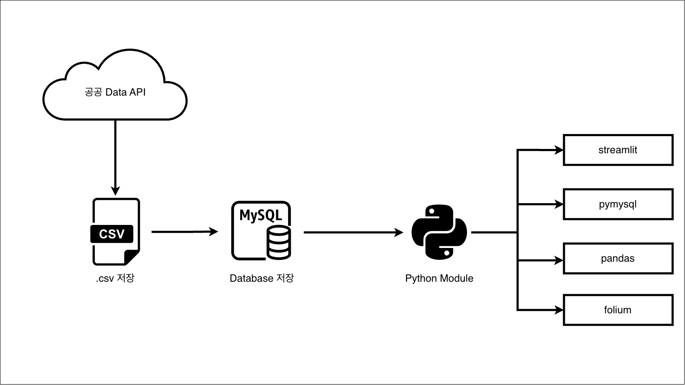

## 🔋 전국 전기차 충전소 현황 대시보드  
 

### 1. Team 3 소개
|  이름  |  구분  |  역할  |
|  :-:  |  :-:  |  :-  |
|  진승언  |  팀장  |  파이프라인 구성, 공공 Data API 추출, DB 구축, 데이터 가공 |
|  공영선  |  팀원  |  MySQL 활용 Data 호출 및 적재  |
|  김승룡  |  팀원  |  데이터 시각화(pandas, folium 기반)  |
|  박내은  |  팀원  |  MySQL 활용 Data 호출 및 적재, Streamlit 구현  |
|  전우영  |  팀원  |  Streamlit 구현  |
 

### 2. 주요 기능
- 전기차 충전소 조회
- 지역별 조회 [ 도/시 > 시군구 or 읍면동 ]
- 운영 관련 세부사항 필터링 조회
  - 24시간 운영 여부
  - 공영/민영 여부 필터링
- 충전소 정보 지도 및 상세 리스트 조회
- 초기 및 검색 후 지도 위치 자동 조정
 

### 3. ERD

 

### 4. 아키텍쳐

 

### 5. 트러블슈팅

|  문제 &nbsp;&nbsp;  |  사용자가 시간을 입력하면 그 시간에 사용이 가능한 전기차 충전소를 보여주려고 했으나, 공공데이터의 시간 데이터가 다음과 같이 제공됨  |
|  :-:  |  :-  |
|  해결과정 &nbsp;&nbsp;  |  데이터에 자연어가 많이 섞여있어 온전히 시간만을 추출하고자 시도 → 16만개의 데이터 값을 일정 패턴으로 추출해내기에 시간적 여유가 부족해 기능을 축소하는 방향으로 계획 변경  |
|  결과 &nbsp;&nbsp;  |  간단하게 24시간, 휴무 없이 매일 이용 가능한지 여부만 표시  |
 

### 개발 방식
- 공부/학습 목적에 중점을 두어 파트를 나누기 보다 모든 팀원이 전 과정을 수행하는 방식으로 진행
1. DB는 구축 후 공유하여 사용
2. pymysql 기반 Query 문을 이용해 공유 DB로부터 데이터 호출
3. pandas, folium 모듈을 이용해 데이터 시각화
4. Streamlit과 기타 Python 모듈을 통한 페이지 구현
 

### 회고
|  팀원  |  소감  |
|  :-  |  :-  |
|   승언 &nbsp;  |  전체 파이프라인과 예상치 못한 문제로 인한 수정은 언제나 힘들다는 것을 또 한번 느낍니다.  |
|   영선 &nbsp; |  전기자동차를 사용하는 입장에서 공영 주차장 여부(50%할인요소) 파악되어 유효했다고 판단합니다. 다만 프로젝트에 도움이 되지 못해 죄송합니다.  |
|   승룡 &nbsp; |  streamlit-folium 모듈을 실제로 활용해서 mysql과 연동도 하고, 뷰로도 보여줄 수 있어서 재밌었습니다. 다만, api 키로 데이터를 받아오는 부분에 대해서는 추가적으로 더 학습이 필요할 것 같습니다.  |
|   내은 &nbsp; |  파이썬과 데이터 전처리 과정이 가장 재밌었습니다!  |
|   우영 &nbsp; |  담당했던 streamlit 50% 정도는 해낸 것 같아 뿌듯하면서도, 주어진 기간 안에 100% 완료하지 못해 아쉬움이 남습니다. 배운 내용을 어떻게 응용하여 실제 프로젝트에 사용할 수 있을지 고민하는 학습 방식이 절실함을 느낍니다.  |
 

### 자료 출처: [생활안전정보](https://safemap.go.kr/opna/data/dataView.do?objtId=118)

