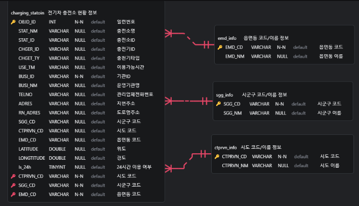
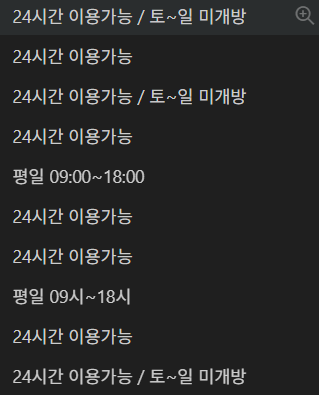

## 주제 : 전기차 충전소 현황 대시보드

### 멤버:
TEAM_3 : 공영선, 전우영, 김승룡, 박내은, 진승언

### 주요 기능
- 전기차 충전소 조회
- 도/시, 시/군/구, 24시간 운영 여부, 공영/민영 여부 필터링
- 지도 위치 자동 조정 및 시각화
- 충전소 상세 정보 리스트로 조회 가능

### ERD

### 트러블슈팅

사용자가 시간을 입력하면 그 시간에 사용이 가능한 전기차 충전소를 보여주려고 했으나,  
공공데이터의 시간 데이터가 다음과 같이 제공되어 불가능하게 됨.

  

=> 데이터에 자연어가 많이 섞여있어 온전히 시간만을 추출하기에는 시간적 여유가 없어 기능 축소 변경.  
간단하게 24시간 매일 이용 가능한지 여부만 표시

### 개발 방식

공부/학습 목적에 중점을 두어 모두 역할을 나누기 보단 전 과정을 모두 다 해보는 방식으로 진행. DB는 구축하여 공유하여 쓰고 그 위에서 Query 문을 날려 데이터를 가져오고 이를 streamlit으로 나타내는 과정을 모두 경험하도록 함.

